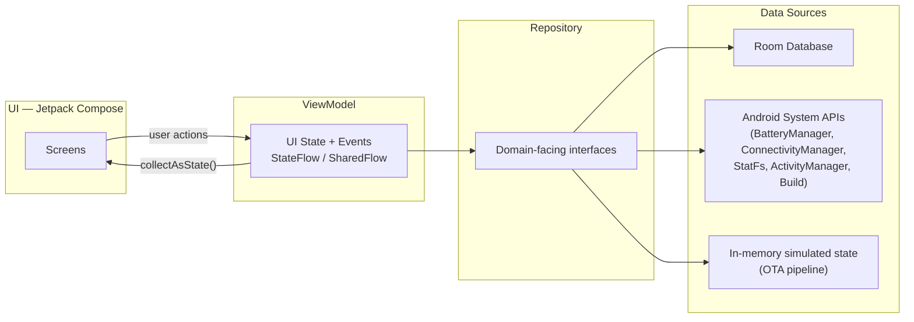

# Android Field Device Health Monitor

A tablet diagnostics and reliability toolkit for field teams deploying and maintaining Android
tablets at scale in low-connectivity environments — schools, mobile clinics, and other settings
where devices are provisioned once and then left largely unattended for long stretches.

> Replace `OWNER` in the badge URL above with your GitHub username/org once this repo is pushed.

---

## Table of Contents

- [Project Overview](#project-overview)
- [Features](#features)
- [Architecture](#architecture)
- [Technical Decisions](#technical-decisions)
- [Screenshots](#screenshots)
- [Installation](#installation)
- [Testing](#testing)
- [Project Structure](#project-structure)
- [Future Improvements](#future-improvements)

---

## Project Overview

Rolling out a fleet of a few hundred Android tablets to rural schools or mobile health clinics
is a fundamentally different problem than supporting a handful of office devices. Field teams
frequently cannot:

- **Rely on connectivity.** Devices may go weeks between seeing a real internet connection, so
  any "phone home and check device health" strategy silently fails exactly when it's needed most.
- **Physically inspect every unit before deployment.** A technician boxing up 200 tablets for a
  school district needs a fast, consistent way to confirm each device is actually fit to ship —
  battery isn't degraded, storage isn't nearly full, the OS and hardware are what the manifest
  says — without plugging each one into `adb` one at a time.
- **Assume a stable OS image forever.** Devices need a path to receive updates, and whoever
  manages the fleet needs to reason about rollback *before* pushing an update, not after a bad
  one bricks a classroom's worth of tablets.
- **Treat "offline" as an edge case.** For a tablet handed to a student for a semester, offline
  is the *normal* operating mode. Any local data capture (e.g., assessment scores) has to work
  fully without a network and reconcile later, not the other way around.

This project is a self-contained Android app that demonstrates the platform engineering
patterns a real device-management/MDM agent would need to address these problems: reading
low-level system state through public Android APIs, running a scriptable device-readiness test
suite, generating a shareable diagnostics report, simulating a locked-down "kiosk" deployment
mode, and modeling an OTA update pipeline's version/validation/rollback lifecycle — all while
keeping every core workflow fully usable with zero connectivity.

## Features

| # | Feature | What it demonstrates |
|---|---------|----------------------|
| 1 | **Device Information Dashboard** | `Build`, `Build.VERSION`, `ActivityManager`, `DisplayMetrics`, `StatFs` |
| 2 | **Battery Health Monitor** | `BatteryManager`, sticky `ACTION_BATTERY_CHANGED` broadcast |
| 3 | **Storage Health Check** | `StatFs`-based usage thresholds → Healthy / Warning / Critical |
| 4 | **Network Connectivity Monitor** | `ConnectivityManager.NetworkCallback`, offline-mode detection |
| 5 | **Offline Learning Data Simulation** | Room-backed offline-first CRUD with a sync-status lifecycle |
| 6 | **Device Diagnostics Test Suite** | "Run Device Check" → pass/fail readiness report |
| 7 | **Diagnostics Report Generator** | Shareable plain-text device report (copy/share) |
| 8 | **Kiosk Mode Prototype** | Simulated lock-task / dedicated-tablet deployment mode |
| 9 | **OTA Update Simulation** | Versioning, checksum validation, rollback-point preparation |

## Architecture

The app follows a standard unidirectional-data-flow MVVM setup with a clean separation between
UI, state, and data access:



```
UI (Compose)  →  ViewModel  →  Repository  →  Data Sources
   screens        UI state       interfaces      Room / Android system APIs /
   + events       (StateFlow)    + impls          in-memory simulated state
```

- **UI (Compose):** Nine feature screens, each a pure function of a `StateFlow`-backed UI state
  plus a handful of callback lambdas — no direct data access from Composables.
- **ViewModel:** Owns UI state, exposes one-shot events (e.g., "record saved") via `SharedFlow`,
  and talks only to repository *interfaces*, never concrete implementations or Android
  framework classes directly — this is what makes the ViewModels unit-testable with plain
  JVM tests and mocked repositories.
- **Repository:** One interface + implementation per concern (device info, battery, storage,
  network, learning records, diagnostics, report generation, OTA, kiosk mode). Each wraps a
  single Android API or the Room DAO, translating platform types (`Intent` extras, `StatFs`
  fields) into plain domain models.
- **Data Sources:** Room (`LearningRecordDao`) for persisted offline data; `BatteryManager`,
  `ConnectivityManager`, `StatFs`, `ActivityManager`, and `Build` for live device state; a small
  in-memory state machine for the OTA simulation.
- **Dependency injection:** A hand-rolled `AppContainer` (created once in the `Application`
  class) wires every repository as a lazily-initialized singleton, and a single
  `ViewModelFactory` constructs ViewModels from it. For an app this size, this keeps every
  wiring decision visible in one file without pulling in an annotation-processing DI framework.

## Technical Decisions

**Why Kotlin.** It's the Android platform's first-class language: null-safety catches a whole
class of "device API returned something unexpected" bugs at compile time, and coroutines/Flow
map naturally onto the async, event-driven nature of system broadcasts (battery changes,
network callbacks) without callback-hell.

**Why Jetpack Compose.** A diagnostics UI is fundamentally a tree of "state in, pixels out"
screens re-rendering as live device metrics change (battery %, storage usage, connectivity).
Compose's declarative, state-driven model is a direct match for that, and it removes an entire
category of manual view-binding bugs that a fleet-diagnostics tool — which needs to be trusted,
not just look good — can't afford.

**Why Room.** The Learning Records feature exists specifically to prove out an offline-first
data flow. Room gives compile-time-checked SQL, a first-class `Flow` return type (so the UI
reacts to database writes automatically), and a well-understood migration story — all without
hand-writing `SQLiteOpenHelper` boilerplate.

**Why MVVM.** ViewModels give each screen a lifecycle-aware place to hold state that survives
configuration changes (a real concern on tablets, which rotate constantly) and — just as
importantly for this project — a boundary that makes business logic unit-testable independent
of Compose or the Android framework.

**Offline-first approach.** Every feature is designed to assume zero connectivity is the normal
case, not a fallback: the Learning Records screen writes straight to Room and only *tracks*
sync status rather than blocking on it, the diagnostics suite treats "offline" as a passing
network check rather than a failure, and the generated report explicitly states connectivity
status rather than omitting it. Nothing in the app blocks on a network call.

## Screenshots

> Replace these placeholders with real captures (`adb shell screencap`) after running the app.

| Device Dashboard | Battery Monitor | Diagnostics Report |
|:---:|:---:|:---:|
| `docs/screenshots/dashboard.png` | `docs/screenshots/battery.png` | `docs/screenshots/diagnostics.png` |

| Learning Records | OTA Update | Kiosk Mode |
|:---:|:---:|:---:|
| `docs/screenshots/records.png` | `docs/screenshots/ota.png` | `docs/screenshots/kiosk.png` |

## Installation

### Prerequisites

- [Android Studio](https://developer.android.com/studio) Koala (2024.1.1) or newer
- JDK 17
- An emulator or physical device running **Android 8.0 (API 26)** or newer

### Clone and open

```bash
git clone https://github.com/OWNER/android-field-device-health-monitor.git
cd android-field-device-health-monitor
```

Open the project in Android Studio and let it sync — the Gradle wrapper JAR
(`gradle/wrapper/gradle-wrapper.jar`) is intentionally **not** committed to this repo to keep it
free of binary artifacts. Android Studio's project sync regenerates it automatically, or you can
do it from the command line if you have a system-wide Gradle install:

```bash
gradle wrapper --gradle-version 8.9
```

From then on, use the regenerated wrapper as usual:

```bash
./gradlew assembleDebug
./gradlew installDebug
```

### Command-line build

```bash
./gradlew testDebugUnitTest   # unit tests
./gradlew lintDebug           # static analysis
./gradlew assembleDebug       # debug APK -> app/build/outputs/apk/debug/
```

## Testing

- **Repository tests** (`app/src/test/.../data/repository`) — pure JVM tests with MockK-mocked
  collaborators, covering validation rules, the diagnostics pass/fail matrix (including that one
  failing subsystem doesn't crash the whole report), report text generation, and the OTA
  check → validate → rollback-prepare → install state machine.
- **Domain model tests** (`app/src/test/.../data/model`) — storage health thresholds, semantic
  version comparison for OTA updates, and diagnostics report pass/fail aggregation.
- **ViewModel tests** (`app/src/test/.../ui/**`) — `MainDispatcherRule` + MockK + Turbine, so
  every ViewModel is exercised with mocked repositories and no Android framework dependency.
- **Database tests** (`app/src/test/.../data/local`) — `LearningRecordDaoTest` runs against a
  real in-memory Room database via Robolectric, so it's a fast JVM test rather than requiring a
  connected device.

Run everything with:

```bash
./gradlew test
```

CI (`.github/workflows/android-ci.yml`) runs lint, unit tests, and a debug assemble on every
push and pull request against `main`.

## Project Structure

```
app/src/main/kotlin/com/fielddevice/healthmonitor/
├── data/
│   ├── local/            # Room database, DAO, entities, type converters
│   ├── model/             # Plain domain models (DeviceInfo, BatteryInfo, ...)
│   └── repository/        # One interface + impl per concern
├── di/                     # AppContainer — manual dependency graph
├── ui/
│   ├── theme/              # Material 3 theme, color, typography
│   ├── navigation/         # NavHost + Screen destinations
│   ├── common/             # Shared composables (SectionCard, StatusBadge, ...)
│   └── <feature>/          # One package per screen: ViewModel + Composable
└── MainActivity.kt
```

## Future Improvements

- **ADB integration.** Wrap `adb shell` device-property queries and batch commands so a
  technician can run the same diagnostics suite across a fleet from a desk, not one tablet at a
  time.
- **OTA update management.** Replace the in-memory simulation with a real update-package
  pipeline: signed packages, `PackageInstaller` session APIs (where the app is the update
  agent) or a `system_server`-level OTA agent (where it's the platform), plus a real staged
  rollout strategy.
- **Device provisioning.** Zero-touch enrollment via `DevicePolicyManager` provisioning
  (`ACTION_PROVISION_MANAGED_DEVICE`) so a new tablet self-configures on first boot instead of
  needing manual setup per unit.
- **Android Enterprise integration.** Register as a proper device-owner/profile-owner app so
  Kiosk Mode becomes real `startLockTask()` enforcement instead of a UI-level simulation, and
  device health can be reported to an EMM console.
